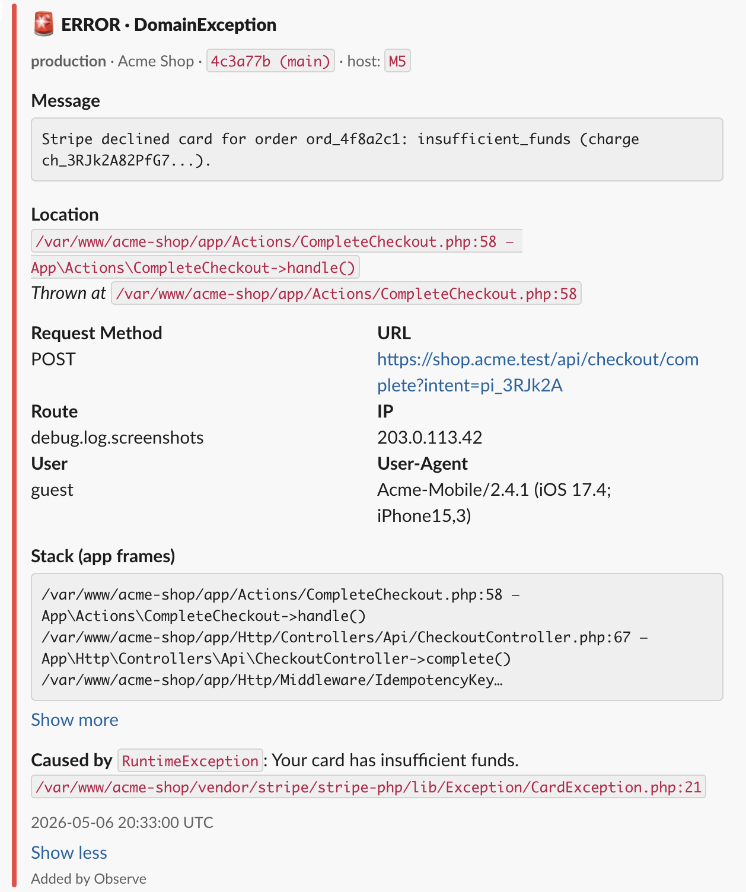
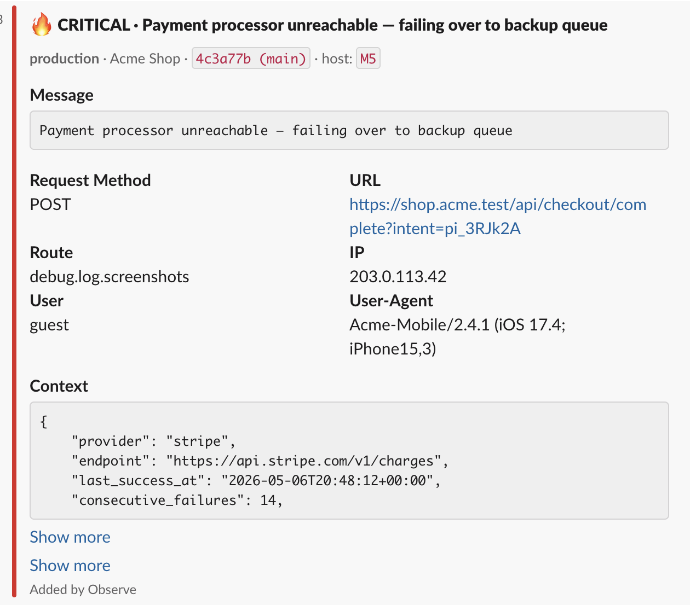
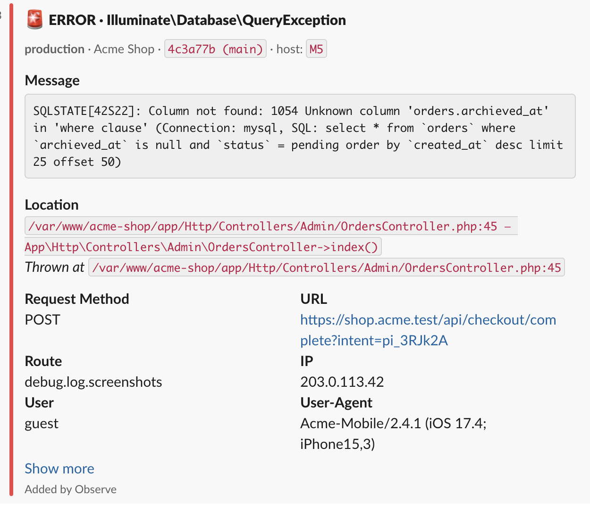

# laravel-pretty-slack-logs

[](https://github.com/justrau/laravel-pretty-slack-logs/actions/workflows/tests.yml)
[](https://packagist.org/packages/justrau/laravel-pretty-slack-logs)
[](https://packagist.org/packages/justrau/laravel-pretty-slack-logs)
[](LICENSE)

A drop-in Slack log channel for Laravel that turns the noisy default error dump into a structured, color-coded Block Kit message — with HTTP request context, git/host info, app-frame Location, Caused-by chains, and JSON context.

## Screenshots



*A domain-level error wrapping a vendor-side cause — env header, request context, app-frame Location, stack trace, and the chained `Caused by`.*



*`Log::critical(...)` with a structured context array — rendered as pretty-printed JSON.*



*`Illuminate\Database\QueryException` with the SQL embedded in the message and a `Caused by PDOException` in the trace below (cropped).*

## What you get

Every error sent to Slack includes:

- **Color sidebar** per log level (warning / error / critical / emergency)
- **Header** with severity emoji, level, and exception class (or message)
- **Environment line**: `local · MyApp · a1b2c3d (main) · host: web-1`
- **Message** in a code block
- **Location** — the first non-vendor stack frame with `file:line — Class::method()`, plus a separate "Thrown at" line if the throw site differs
- **Request context** for HTTP requests: method, URL, route name, IP, authenticated user, user-agent
- **Console context** for artisan commands: full command line
- **Stack (app frames)** — top frames excluding `vendor/` and entry points
- **Caused by** chain — each previous exception rendered with the same Location-style format
- **Context** — any `Log::error('msg', [...context])` array, pretty-printed JSON
- **Footer** with timestamp

Long fields are automatically truncated with a `… (truncated)` marker so messages never blow Slack's block size limits.

## Requirements

- PHP 8.2+
- Laravel 11, 12, or 13
- A Slack [Incoming Webhook URL](https://api.slack.com/messaging/webhooks)

## Install

```bash
composer require justrau/laravel-pretty-slack-logs
```

## Configure

Add a channel to `config/logging.php`:

```php
use JustRau\PrettySlackLogs\Channel;

return [
    'channels' => [

        'stack' => [
            'driver' => 'stack',
            'channels' => ['daily', 'pretty-slack'],
            'ignore_exceptions' => false,
        ],

        'pretty-slack' => [
            'driver' => 'custom',
            'via' => Channel::class,
            'url' => env('LOG_SLACK_WEBHOOK_URL'),
            'level' => env('LOG_SLACK_LEVEL', 'error'),
        ],

    ],
];
```

Then add to `.env`:

```
LOG_SLACK_WEBHOOK_URL=https://hooks.slack.com/services/XXX/YYY/ZZZ
LOG_SLACK_LEVEL=error
```

That's it. Errors logged at or above `LOG_SLACK_LEVEL` will be posted to Slack.

## Usage

Anything that hits the configured channel gets formatted automatically:

```php
// Throws → caught by Laravel's exception handler → reported to the stack channel
throw new RuntimeException('Boom');

// Reported manually
report(new DomainException('handled but worth flagging'));

// Direct logger calls with context
Log::error('Failed to send notification', [
    'user_id' => 42,
    'channel' => 'email',
    'attempt' => 3,
]);

// Direct to this channel
Log::channel('pretty-slack')->critical('Payment processor unreachable', [
    'provider' => 'stripe',
    'amount' => 12345,
]);
```

## Configuration options

| Key | Default | Description |
|---|---|---|
| `url` | _none_ | Slack webhook URL. If empty, the handler silently no-ops. |
| `level` | `error` | Minimum log level to send (debug, info, notice, warning, error, critical, alert, emergency). |
| `name` | `pretty-slack` | The Monolog channel name attached to each record. |

## License

MIT — see [LICENSE](LICENSE).
